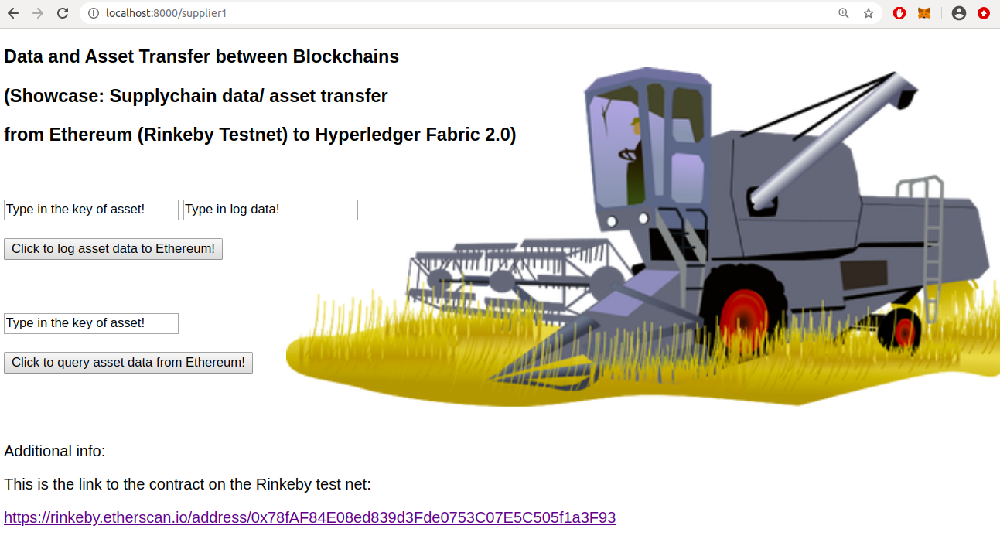
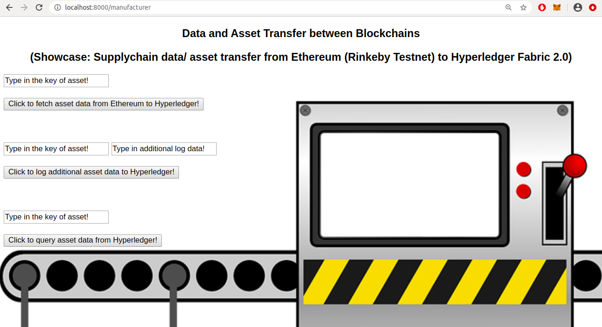

# Showcase of blockchain interoperability in the field of supply chain 

A video recording of the showcase can be found here: https://www.youtube.com/watch?v=Ldh-b4Hu5LE&feature=youtu.be

A product is tracked along the supply chain in this showcase. The supplier has a website (http://localhost:8000/supplier1) and can log product data with its associated timestamp to the public Ethereum network. The manufacturer has a website as well (http://localhost:8000/manufacturer). The manufacturer can fetch the already available product data from the Ethereum network to his/her local Hyperledger Fabric network. The manufacturer can add additional product data with its associated timestamp to the local Hyperledger Fabric network. The supplier as well as the manufacturer can query the product data on their respective networks at any time. 

Access control has to be implemented in the Ethereum contract in the future if this showcase is used in prouction to ensure that only authorized suppliers can add product data.

## Screenshot of the supplier's website:
<br></br><br></br>

## Screenshot of the manufacturere's website:
<br></br><br></br>


## Getting Started

These instructions will get you a copy of the project up and running on your local machine for development and testing purposes.

### Prerequisites Hyperledger Fabric 2.0

The following prerequisites have to be installed to run Hyperledger Fabric 2.0 locally on your machine:


- Install docker

sudo apt-get install docker.io

sudo systemctl start docker

sudo systemctl enable docker

sudo usermod -a -G docker $USER

- Install docker-compose

sudo apt-get install docker-compose

- Install Hyperledger Fabric 2.0 binaries

curl -sSL https://bit.ly/2ysbOFE | bash -s -- 2.0.0

- Install npm and node.js

curl -sL https://deb.nodesource.com/setup_10.x | sudo -E bash -

sudo apt-get install -y nodejs

sudo apt-get install build-essential

- Clone this repository

git clone https://github.com/DOBEN/Showcase_of_blockchain_interoperability_in_the_field_of_supply_chain.git

- Install required node dependencies from the package.json file in the folder "website"

cd Showcase_of_blockchain_interoperability_in_the_field_of_supply_chain/website

npm install 

- Finally start the Hyperledger Fabric network and website

cd Showcase_of_blockchain_interoperability_in_the_field_of_supply_chain

sudo ./start_Network.sh

### Prerequisites Ethereum

The following prerequisites have to be installed to interact with Ethereum through your Chrome web browser:

- MetaMask as a browser plug-in
- Create an account in MetaMask
- Select "Rinkeby Test Network" in the drop-down menu in MetaMask
- Get some free Test Ether for the Rinkeby Network from an online faucet


### To run this code:

- cd Showcase_of_blockchain_interoperability_in_the_field_of_supply_chain

- sudo ./start_Network.sh

### Additional Comments

The following smart contract is installed on the Hyperledger Fabric 2.0 network but it can be replaced with any other smart contract code. The website interacts with the Hyperledger Fabric network through the Node Fabric SDK at the two backend files "Query_Hyperledger.js" and "Invoke_Hyperledger.js".

```go
package main

import (

	"fmt"
	"strconv"
	"encoding/json"
	"github.com/hyperledger/fabric-chaincode-go/shim"
	sc "github.com/hyperledger/fabric-protos-go/peer"
)

// Define the Smart Contract structure
type SmartContract struct {

}

/*
 * The Invoke method is called as a result of an application request to run the Smart Contract.
 * The calling application program has also specified the particular smart contract function to be called, with arguments
 */
func (s *SmartContract) Invoke(APIstub shim.ChaincodeStubInterface) sc.Response {

	// Retrieve the requested Smart Contract function and arguments
	function, args := APIstub.GetFunctionAndParameters()
	// Route to the appropriate handler function to interact with the ledger appropriately
	if function == "store" {
		return s.store(APIstub, args)
	} else if function == "Init" {
		return s.Init(APIstub)
	} else if function == "retrieve" {
		return s.retrieve(APIstub, args)
	} else {fmt.Println("Invalid Smart Contract function name.")
	return shim.Error("Invalid Smart Contract function name.")}
}

type unit struct {
	Value string `json:"value"`
}

func (s *SmartContract) retrieve(APIstub shim.ChaincodeStubInterface, args []string ) sc.Response {
	var iterator,err=APIstub.GetStateByPartialCompositeKey("key~timestamp",  []string{args[0]})
	if err != nil {
		fmt.Printf("error,error")
		return shim.Error(err.Error())
	}
	defer iterator.Close()
	total_result:="\"{"

	// Iterate through result set 
	var i int
	var unitJSON unit
	for i = 0; iterator.HasNext(); i++ {

		responseRange, err := iterator.Next()
		if err != nil {
			return shim.Error(err.Error())
		}

		_, compositeKeyParts, err := APIstub.SplitCompositeKey(responseRange.Key)
		if err != nil {
			return shim.Error(err.Error())
		}

		returnedTimestamp := compositeKeyParts[1]  
		err = json.Unmarshal(responseRange.Value, &unitJSON)
		if err != nil {
			jsonResp := "{\"Error\":\"Failed to decode JSON. \"}"
			return shim.Error(jsonResp)
		}
	
		total_result=total_result+"\\\"Object"+strconv.Itoa(i)+"\\\":{\\\"key\\\":\\\""+args[0]+"\\\",\\\"time\\\":\\\""+returnedTimestamp+"\\\",\\\"value\\\":\\\""+unitJSON.Value+"\\\"}"
		if (iterator.HasNext()){
			total_result=total_result+","
		} else {
			total_result=total_result+",\\\"length\\\":\\\""+strconv.Itoa(i+1)+"\\\""
		}
	}

	total_result=total_result+"}\""

	return shim.Success([]byte(total_result))
}

func (s *SmartContract) store(APIstub shim.ChaincodeStubInterface, args []string ) sc.Response {

	var compositeKey, err=APIstub.CreateCompositeKey("key~timestamp",[]string{args[0],args[1]})

	if err != nil {
		return shim.Error(err.Error())
	}

	APIstub.PutState(compositeKey, []byte(args[2])); 

	return shim.Success(nil)
}

func (s *SmartContract) Init(APIstub shim.ChaincodeStubInterface ) sc.Response {
	return shim.Success(nil)
}

func main() {
	//Create a new Smart Contract
	err := shim.Start(new(SmartContract))
	if err != nil { 
		fmt.Printf("Error creating new Smart Contract: %s", err)
	}
}
```

The following solidity contract is deployed on the Rinkeby Testnet (Ethereum) but it can be replaced with any other solidity contract code. The website interacts with the Ethereum network through the web3.js library at the frontend files "manufacturer.html" and "supplier1.html" .

This is the link to the contract on the Rinkeby test net:
https://rinkeby.etherscan.io/address/0x78fAF84E08ed839d3Fde0753C07E5C505f1a3F93

```
pragma solidity >= 0.4.22 < 0.7.0;


contract Storage {

    struct Action{
        uint256 timestamp;
        string action_happening;
    }

    mapping(string => Action[]) assets;

    function store(string memory _key, string memory _value) public {
        assets[_key].push(Action(now, _value));
    }

    function length(string memory _key) public view returns(uint256){
       return assets[_key].length;  
    }

    function retrieve(string memory _key, uint256 index) public view returns (uint256, string memory){
        return (assets[_key][index].timestamp, assets[_key][index].action_happening);    
    }
}
```